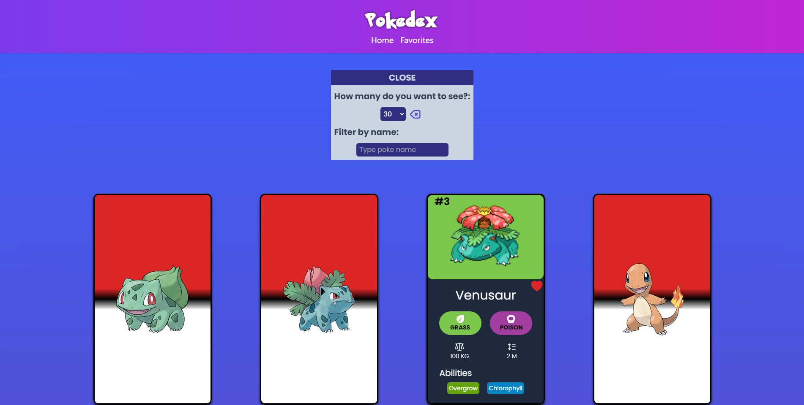

## Table of contents

- [Overview](#overview)
  - [Screenshot](#screenshot)
  - [Links](#links)
- [My process](#my-process)
  - [Built with](#built-with)
  - [What I learned](#what-i-learned)
- [Author](#author)

## Overview

### Screenshot

### Links

- Live Site URL: [Netlify](https://pokedex-bybrusen.netlify.app/)🎇

## My process

### Built with

- Semantic HTML5 markup
- CSS custom properties
- TailwindCSS
- React
- Mobile-first workflow
- Fetch
- What API did I work with?: 
[PokeAPI LINK](https://pokeapi.co/)

### What I learned

I'm learning to use states in react, since it is a framework with which I'm working and the way in which states are handled was dynamic and to be able to create a hooks to avoid having to repeat code

## Author

- GitHub - [@brujavsen]